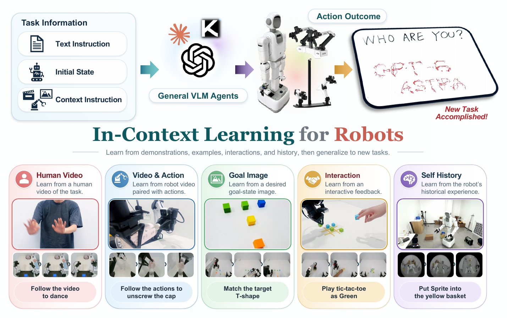
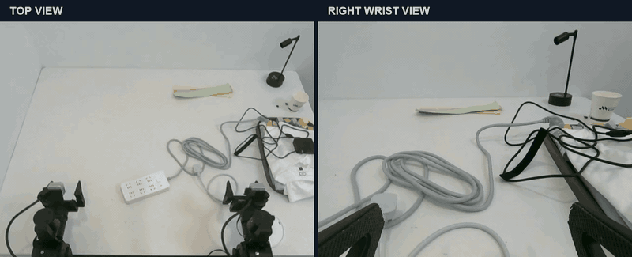
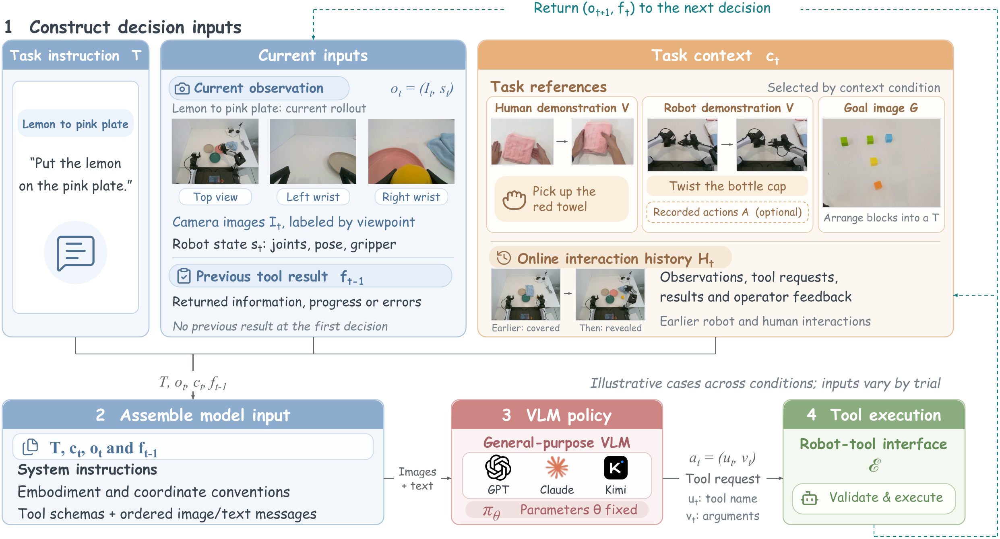

<div align="center">
  
</div>

<div align="center">
  
</div>

# GPT-Policy: In-Context Robot Learning with VLM Agents

This repository is the public implementation of GPT-Policy, a closed-loop control framework that connects a fixed vision-language model (VLM) to robot tools. At deployment time, the agent can use demonstrations, goal images, interaction history, and execution feedback without gradient updates or task-specific parameter changes.

[](https://www.python.org/downloads/)
[](https://github.com/cheng-haha/GPT-Policy-Eval)

**Paper:** *In-Context Robot Learning with VLM Agents*  \
**Authors:** Dongzhou Cheng, Taoran Yi, Ye Fang, Xingwu Zhang, Fan Feng, Yixuan Li, Gengxiong Zhuang, Rongze Wang, Shuai Yang, Wei Song, Weizhi Xue, Minyan Wu, Jie Gui, Jiaqi Wang, and Tong Wu.

<details>
<summary>Abstract</summary>

Robots must adapt to tasks and environments that cannot be exhaustively covered by a finite training set. GPT-Policy studies whether a general-purpose VLM can learn from demonstrations, examples, and interaction feedback, then produce executable and verifiable robot behavior from a new initial state. A context compiler preserves task-relevant visual transitions, the VLM proposes structured robot-tool actions, and a constrained controller verifies, executes, and reports each action. The paper evaluates human and robot demonstrations, goal images, self-interaction history, and online human-robot interaction in real-robot tasks, while documenting the remaining gap between task reasoning, contact execution, outcome verification, and physical safety.
</details>

## Demo

Plug insertion with synchronized top and right wrist views: the robot grasps the plug, aligns it with the power strip, inserts it, and releases it while adjusting through contact.

<p align="center">
  <a href="https://github.com/cheng-haha/GPT-Policy-Eval/raw/refs/heads/main/docs/assets/plug-insertion-top-and-right-wrist.mp4">
    
  </a>
  <br />
  <sub>Left: top view · Right: right wrist view · 12× playback · <a href="https://github.com/cheng-haha/GPT-Policy-Eval/raw/refs/heads/main/docs/assets/plug-insertion-top-and-right-wrist.mp4">Download MP4 ↗</a></sub>
</p>

## Method overview

<div align="center">
  
</div>

GPT-Policy builds one model input from the task, live camera/state observations, task references, and the previous tool result. The VLM emits one structured request; the selected adapter validates and executes it, then returns fresh observations and feedback for the next decision. Adapters support Cartesian targets and waypoint sequences, sequential IK checks, backend-specific timing, gripper control, and append-only run recording.

The available context types are:

- **Human Video:** a visual procedure that can transfer across embodiments.
- **Robot Video / Video + Action:** robot interactions, arm roles, and aligned motion references.
- **Target Image:** the desired object arrangement, position, and spacing.
- **Self History:** earlier observations, actions, results, and discovered subgoals.
- **Human-Robot Interaction:** live intent, pointing, corrections, and turn-taking.

## Installation

Python 3.10 or newer is required.

```bash
python -m venv .venv
source .venv/bin/activate
python -m pip install -e .
```

The base install is hardware-free. Install only the backend you need:

```bash
source .venv/bin/activate
python scripts/install_drivers.py arx
python scripts/install_drivers.py yam
python scripts/install_drivers.py realsense
# or: python -m pip install -e '.[arx,realsense]'
```

Agent CLIs are external dependencies. Install and authenticate the provider you select; credentials are stored outside this repository.

## Quick start

For the default ARX profile, edit the placeholders in `configs/arx_gpt.json` once, then run a task directly:

```bash
source .venv/bin/activate
gpt-policy "pick up the red block"
```

The command resolves `configs/arx_gpt.json` automatically. To validate the profile without opening hardware or a model session:

```bash
gpt-policy --check
```

For another machine or provider, pass an explicit profile:

```bash
cp configs/examples/yam-local.json configs/my-machine.json
# edit interfaces, camera serials, and measured calibration
gpt-policy --config configs/my-machine.json "pick up the red block"
```

An input package can contain text, images, videos, or reviewed demonstrations:

```bash
gpt-policy --input-json task.json
```

Each motion is planned from fresh feedback, checked with per-sample IK, and recorded as an append-only run directory. `Ctrl+C` requests software cancellation and cleanup; it does not replace a hardware emergency stop.

## Results from the paper

The paper repeats each condition three times. Human Video improves towel and notebook pickup from `0/3` without context to `2/3`; Robot Video + Action reaches `3/3` on bottle opening and `2/3` on plug reinsertion. Target Image, Self History, and Human-Robot Interaction each achieve `3/3` on the reported tasks. These results measure task outcomes in selected trials and do not certify safe autonomous deployment.

## Repository layout

```text
src/gpt_policy/       protocol, input preparation, planning, recording, adapters
configs/arx_gpt.json  default sanitized ARX profile for `gpt-policy "..."`
configs/agents/       provider examples
configs/examples/     local-machine templates
scripts/              opt-in driver installation
tests/                offline protocol and configuration tests
docs/assets/          figures used in this README
```

The public tree excludes deployment hosts, private prompts, real credentials, run recordings, site-specific calibration, and evaluation history. The paper's physical demonstration records and complete evaluation environment are not included by implication.

## Development

```bash
python -m pytest -q
python -m compileall -q src
```

## Limitations and safety

This is a research control loop. The integrator must verify calibration, workspace limits, collision behavior, camera placement, provider configuration, and emergency-stop procedures before energizing a robot. IK acceptance and a model completion message do not establish collision-free motion or physical task success. The project license is intentionally pending; redistribution and commercial use are not granted by this preview.

See [THIRD_PARTY.md](THIRD_PARTY.md) for third-party notices and optional SDK sources.

## Citation

```bibtex
@misc{cheng2026gptpolicy,
  title        = {In-Context Robot Learning with VLM Agents},
  author       = {Cheng, Dongzhou and Yi, Taoran and Fang, Ye and Zhang, Xingwu and Feng, Fan and Li, Yixuan and Zhuang, Gengxiong and Wang, Rongze and Yang, Shuai and Song, Wei and Xue, Weizhi and Wu, Minyan and Gui, Jie and Wang, Jiaqi and Wu, Tong},
  year         = {2026},
  howpublished = {\url{https://github.com/cheng-haha/GPT-Policy-Eval}}
}
```

## Acknowledgements

GPT-Policy integrates optional ARX, I2RT/YAM, RealSense, and provider CLI interfaces. Please see [THIRD_PARTY.md](THIRD_PARTY.md) before redistributing a deployment that includes external SDKs.
