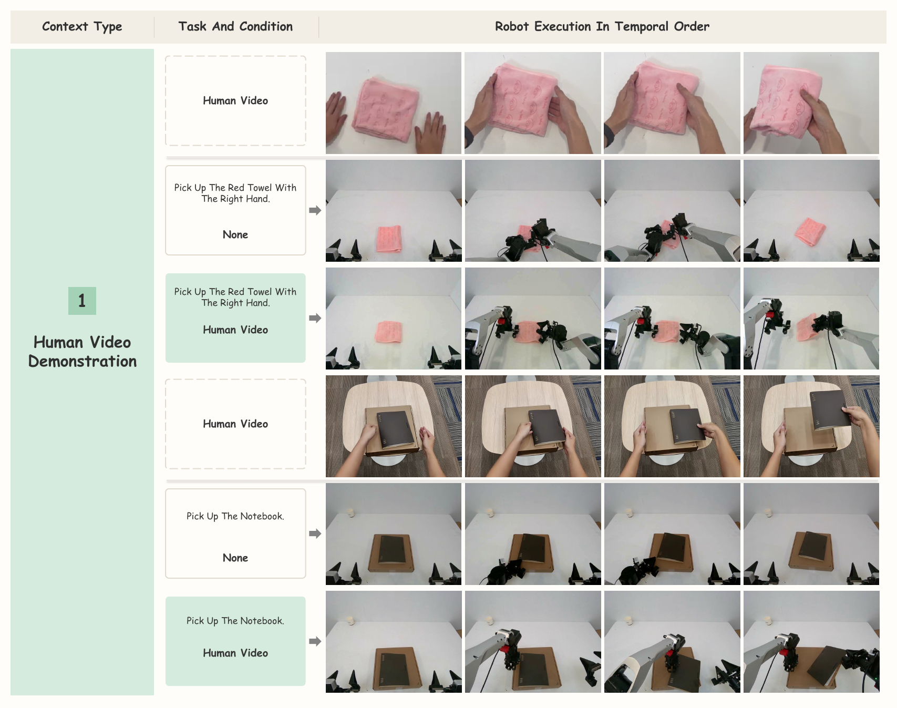
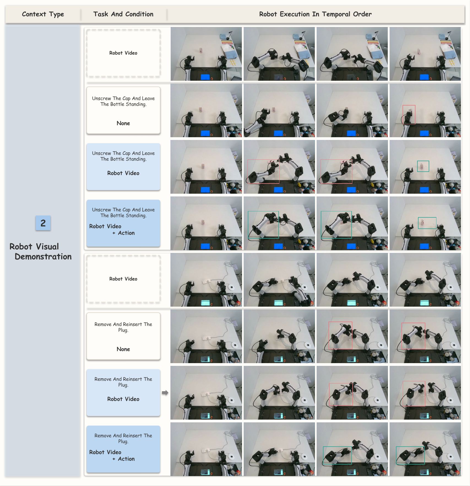

# GPT-Policy

**In-Context Robot Learning with VLM Agents**

GPT-Policy is a general-agent framework that connects a fixed vision-language model (VLM) to robot tools through a shared, closed-loop interface. It lets an agent use task instructions, demonstrations, goal images, interaction history, and execution feedback to adapt its behavior at deployment time, without gradient updates or task-specific parameter changes.

[](https://www.python.org/downloads/)
[](#development)

> **Public source preview.** This repository is intended for research and integration work. Physical robot commissioning, calibration, collision checking, and safety review remain the responsibility of the integrator. Do not use the example configurations as deployment profiles.

## Paper and project

**Paper:** *In-Context Robot Learning with VLM Agents*  
**Authors:** Dongzhou Cheng, Taoran Yi, Ye Fang, Xingwu Zhang, Fan Feng, Yixuan Li, Gengxiong Zhuang, Rongze Wang, Shuai Yang, Wei Song, Weizhi Xue, Minyan Wu, Jie Gui, Jiaqi Wang, and Tong Wu.

The paper studies whether general-purpose VLM agents can learn from context and produce executable, verifiable robot behavior from a new initial state. The paper project page and evaluation materials are available at [cheng-haha/GPT-Policy-Eval](https://github.com/cheng-haha/GPT-Policy-Eval).

## What the paper contributes

The framework separates three responsibilities:

1. **Context compiler** selects task-relevant visual transitions, action references, and interaction records.
2. **VLM policy** combines the task, live observations, context, and tool schemas to propose one structured robot-tool request at a time.
3. **Constrained controller** resolves Cartesian targets, checks inverse kinematics (IK), executes the motion, and returns measured state and execution feedback for replanning.

The VLM parameters remain fixed during a trial. Adaptation comes from the context supplied at test time and from the closed-loop feedback returned after each request.

<p align="center">
  
</p>

*The framework accepts human and robot demonstrations, goal images, self-interaction history, and online human interaction as task context.*

## Core method

<p align="center">
  
</p>

At decision step $t$, the model receives the task instruction $T$, current observation $o_t$, task context $c_t$, and the previous tool result $f_{t-1}$. It emits a structured request $a_t = (u_t, v_t)$. The selected adapter validates and executes the request, then supplies $o_{t+1}$ and $f_t$ to the next decision.

The controller supports single-target and waypoint-sequence Cartesian requests. It interpolates position and orientation, solves IK sequentially from the measured joint state, applies backend-specific timing and limits, and reports endpoint and settling feedback. A model-declared completion is kept distinct from independently verified physical task success.

## Context types

| Context | Information supplied | What it specifies |
| --- | --- | --- |
| Human Video | Chronological human demonstration keyframes | A procedure that can transfer across embodiments |
| Robot Video | Teleoperated robot keyframes | Object interactions, arm roles, and action order |
| Robot Video + Action | Robot keyframes with aligned state/action records | Motion references between sparse visual keyframes |
| Target Image | Desired final arrangement | Object identity, relative position, and spacing |
| Self History | Earlier observations, requests, results, and feedback | Past discoveries, failed attempts, and intermediate subgoals |
| Human-Robot Interaction | Live human moves, pointing, or corrections | Intent, turn-taking, and changing task rules |

Historical demonstrations are reference data, not pending commands. The current scene and measured state always determine the next executable target.

## Results reported in the paper

Each condition was repeated three times. `S/T` is successful trials over total trials; decisions and time are averaged over all trials, including failures.

| Task | Context | Success | Decisions | Time (min) |
| --- | --- | ---: | ---: | ---: |
| Pick Red Towel | None / Human Video | 0/3 / **2/3** | 96.3 / **76.7** | 24.6 / **18.9** |
| Pick Up Notebook | None / Human Video | 0/3 / **2/3** | 94.0 / **66.7** | 24.6 / **16.1** |
| Unscrew Bottle Cap | None / Robot Video / Video + Action | 0/3 / 2/3 / **3/3** | 71.0 / 74.3 / **54.7** | 16.1 / 15.2 / 17.9 |
| Remove and Reinsert Plug | None / Robot Video / Video + Action | 0/3 / 0/3 / **2/3** | 24.0 / 33.7 / **48.3** | 5.3 / 7.9 / 10.8 |
| Arrange T Shape | Target Image | **3/3** | 66.7 | 15.8 |
| Arrange Fruit | Target Image | **3/3** | 49.0 | 12.4 |
| Lemon to Pink Plate | Self History | **3/3** | 35.3 | 8.1 |
| Movable Exploration | Self History | **3/3** | 40.33 | 25.53 |
| Tic-Tac-Toe | Human-Robot Interaction | **3/3** | 69.7 | 13.6 |
| Pointed Fruit Pickup | Human-Robot Interaction | **3/3** | 67.3 | 15.0 |

<p align="center">
  
  
</p>

The results show that context can improve task interpretation and action selection, while contact-rich execution and outcome verification remain difficult. The paper also reports observed inter-arm collisions; this public preview should therefore be treated as a research control loop, not as a safety certification.

## Installation

Python 3.10 or newer is required. From this directory:

```bash
python -m venv .venv
.venv/bin/python -m pip install -e .
```

The base install is hardware-free. Install only the backend you need:

```bash
.venv/bin/python scripts/install_drivers.py arx        # ARX5 SDK
.venv/bin/python scripts/install_drivers.py yam        # I2RT/YAM SDK
.venv/bin/python scripts/install_drivers.py realsense  # RealSense cameras
# or: .venv/bin/python -m pip install -e '.[arx,realsense]'
```

Agent CLIs are external dependencies. Install and authenticate the provider you select, then point the configuration at your local provider settings. Never commit credentials.

## Configure a local machine

Start from a sanitized template and replace every placeholder with measurements from your own setup:

```bash
cp configs/examples/arx-local.json configs/my-machine.json
# edit CAN names, camera paths, scene notes, and calibration
.venv/bin/gpt-policy --config configs/my-machine.json --check
```

`--check` validates schemas and calibration without opening hardware or starting a model. A valid deployment configuration must provide the calibrated TCP transforms, camera intrinsics, and relevant camera transforms. Keep these measurements local; they are installation data rather than portable defaults.

For YAM, use `configs/examples/yam-local.json`, install the YAM and RealSense extras, and fill in camera serials and measured transforms.

## Run a task

The command accepts text or a JSON input package containing text, images, videos, or reviewed demonstrations:

```bash
.venv/bin/gpt-policy --config configs/my-machine.json "pick up the red block"
.venv/bin/gpt-policy --config configs/my-machine.json --input-json task.json
```

Each motion is planned from fresh feedback, checked with per-sample IK, and recorded as an append-only run directory. `Ctrl+C` requests the adapter cancellation and cleanup sequence; it does not replace a hardware emergency stop.

## Repository layout

```text
src/gpt_policy/       model/tool protocol, vision geometry, planning, recording, adapters
configs/tools.json    validated model-visible tool catalog
configs/agents/       provider examples
configs/examples/     sanitized local-machine templates
scripts/              opt-in driver installation
tests/                offline protocol and configuration tests
docs/assets/          paper figures used in this README
```

The public tree intentionally excludes deployment hosts, CAN and camera mappings, site-specific calibration, run recordings, evaluation history, and private prompts. The paper's demonstration records and full physical evaluation environment are not implied to be included in this repository.

## Development

```bash
.venv/bin/python -m pytest -q
.venv/bin/python -m compileall -q src
```

Keep hardware access behind adapter boundaries. Contributions should include a short reproduction and an offline test for protocol or configuration changes. Do not add credentials, private hostnames, serial numbers, calibration reports, or recorded user data to issues or pull requests.

## License and third-party code

The project license is intentionally pending; redistribution and commercial use are not granted by this preview. See [THIRD_PARTY.md](THIRD_PARTY.md) for third-party notices and optional SDK sources.

## Citation

If GPT-Policy is useful in your research, please cite:

```bibtex
@misc{cheng2026gptpolicy,
  title        = {In-Context Robot Learning with VLM Agents},
  author       = {Cheng, Dongzhou and Yi, Taoran and Fang, Ye and Zhang, Xingwu and Feng, Fan and Li, Yixuan and Zhuang, Gengxiong and Wang, Rongze and Yang, Shuai and Song, Wei and Xue, Weizhi and Wu, Minyan and Gui, Jie and Wang, Jiaqi and Wu, Tong},
  year         = {2026},
  howpublished = {\url{https://github.com/cheng-haha/GPT-Policy-Eval}}
}
```
