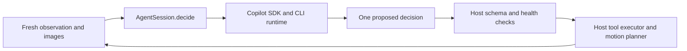

# Copilot subscription migration assessment

Reviewed 2026-09-20 against project commit `4c43e57`. Confirmed deployment: locally, signed in as an individual employee. This is an assessment and implementation plan; the runtime has not been migrated or tested with a company account.

The subsequent [replacement design](copilot-replacement-design.md) selects the terminal proposal-tool approach and specifies code sketches, file changes, lifecycle rules, and acceptance tests. Use that design for implementation; the options below remain the feasibility background.

## Conclusion

GitHub Copilot SDK is a viable integration route for running this project's model calls with a company-assigned Copilot subscription. GitHub explicitly supports using the signed-in user's Copilot entitlement through the SDK. The simplest deployment is a local application authenticated as the employee who holds the seat. Company policy, available models, and remaining usage must still be checked under that identity. [SDK authentication](https://docs.github.com/en/copilot/how-tos/copilot-sdk/auth/authenticate)

The SDK plays a similar architectural role to Codex app-server, but its protocol and Python API differ. Replacing the executable name or putting a GitHub token into the Codex configuration will not implement the migration. Add a Copilot provider behind the existing `AgentSession` interface.

## Authentication, model access, and billing

1. Authenticate the intended company GitHub identity using Copilot CLI login. The SDK can reuse stored credentials. Check for inherited `COPILOT_GITHUB_TOKEN`, `GH_TOKEN`, or `GITHUB_TOKEN`: these can take precedence over the stored login. Credentials belong outside project configuration. [Authentication](https://docs.github.com/en/copilot/how-tos/copilot-sdk/auth/authenticate)
2. Confirm the account has a Copilot seat, enterprise/organization policy enables Copilot CLI, and the desired model is enabled. Access through an IDE alone does not verify CLI policy. [Enterprise administration](https://docs.github.com/en/copilot/how-tos/copilot-cli/administer-copilot-cli-for-your-enterprise)
3. Discover models through the authenticated runtime. Choose a GPT model that supports the required images, context size, and reasoning options. Do not assume this repository's `gpt-6-astra` or naming model `gpt-5.6-luna` is available under the Copilot account. [Supported models](https://docs.github.com/en/copilot/reference/ai-models/supported-models)
4. Keep subscription authentication selected. BYOK routes requests to separately billed model-provider credentials and does not spend the Copilot subscription allowance. [Authentication options](https://docs.github.com/en/copilot/how-tos/copilot-sdk/auth/authenticate)

Subscription access is metered. Current dedicated billing documentation describes token-based AI credits, with monthly included credits pooled at the billing entity for organizations and enterprises. Do not budget using old fixed premium-request counts or assume unlimited inference. This project can make up to 100 control decisions by default, plus task naming, video-window selection, review, and retries. Actual cost depends on model and context, especially repeated images. [Organization billing](https://docs.github.com/en/enterprise-cloud@latest/copilot/concepts/billing-and-usage/organizations-and-enterprises/billing)

For a shared unattended service, decide its identity explicitly. GitHub also documents organization-attributed server authentication with installation tokens, separate from using an employee's seat. That path has its own organization policy and billing requirements; it should not be treated as interchangeable with the local subscription setup. [Server authentication](https://docs.github.com/en/copilot/how-tos/copilot-sdk/auth/server-to-server-tokens)

## What this project actually needs

The control loop already separates inference from execution:

`harness/codex.py` launches `codex app-server`, sends `thread/start`, and uses `turn/start.outputSchema`. It puts the robot tool catalog in the prompt; it does **not** give Codex callbacks that move the robot. `runtime/runner.py` receives one `{name, arguments, _wire}` decision and executes it locally. Preserve that boundary in the Copilot adapter.

The Copilot SDK also talks to a local CLI runtime through JSON-RPC and manages its lifecycle. The schemas and event names are different from Codex's. [Copilot architecture](https://github.com/github/copilot-sdk#architecture), [Codex app-server](https://learn.chatgpt.com/docs/app-server)

## Compatibility and the release-version gap

At review time GitHub's latest release link resolved to **v1.0.14**. Its Python session API accepts image attachments, offers asynchronous send/wait operations, and exposes explicit abort. A camera image can be passed as a base64 blob with its MIME type; preserve camera labels and frame timestamps in the accompanying prompt. [Release](https://github.com/github/copilot-sdk/releases/tag/v1.0.14), [released session source](https://github.com/github/copilot-sdk/blob/v1.0.14/python/copilot/session.py)

The `main` branch documents experimental `response_schema` and `send_and_wait_typed` support, but those helpers are absent from the inspected v1.0.14 session wrapper. Do not copy development-branch examples into an installation pinned to that release. Even the experimental schema path depends on model support. [Development documentation](https://github.com/github/copilot-sdk/blob/main/python/README.md#structured-output-experimental)

For the first released-version prototype, request JSON with native execution tools disabled and validate the entire response through the existing `parse_decision`. Treat invalid, missing, or multiple decisions as failed inference, never as permission to move. This preserves local validation but does not provide Codex's generation-time schema constraint. Measure invalid-output frequency before choosing it for regular runs.

A stronger released-version candidate is one custom `propose_action` tool using the existing decision schema and `is_terminal=True`. Its callback validates and stores a proposal without executing hardware. A successful terminal-tool result ends the model turn; failure can allow another attempt. Enforce one accepted proposal per observation and a bounded deadline in host code. These semantics were checked in source, not in a live model session. [Released tool API](https://github.com/github/copilot-sdk/blob/v1.0.14/python/copilot/tools.py#L73)

SDK tool permissions are not an operating-system sandbox. The released client distinguishes an empty `available_tools=[]` allowlist from default tools. For the proposal approach, allow only the custom proposal tool. Deny unwanted runtime interactions and verify the effective tool set under the pinned version. Keep physical execution in the existing host controller. [Released client configuration](https://github.com/github/copilot-sdk/blob/v1.0.14/python/copilot/client.py#L2196)

The released Python SDK requires Python **3.11+**, while this project currently declares **3.10+**. Choose either a higher project minimum or a Copilot optional extra restricted to supported Python versions with a clear preflight error. Its wheel pins a compatible runtime which can be staged with `python -m copilot download-runtime`; a separately installed global CLI is not required for the SDK-managed path. [Released Python requirements and runtime](https://github.com/github/copilot-sdk/blob/v1.0.14/python/README.md#prerequisites)

## Required project changes

Paths and line numbers refer to the inspected commit. Source paths below are relative to `src/gpt_policy/`; `configs/` and `pyproject.toml` are at the repository root.

| Location | Change |
| --- | --- |
| `harness/contract.py:8`, new `harness/providers/copilot.py` | Implement synchronous `start`, `decide`, and `close` around a persistent asynchronous SDK client/session. |
| `harness/config.py:13`, `:74`, `:109`; `harness/factory.py:10` | Add a distinct Copilot configuration branch and provider registration. Existing non-Codex config assumes Claude credentials, so adding a selector alone is insufficient. |
| New `configs/agents/copilot.json`; `main.py:128` | Add explicit entitled model configuration and a Copilot run-directory mapping. Keep credentials outside JSON. |
| `main.py:182`; `harness/task_name.py:75` | Stop loading Codex unconditionally for automatic task matching/naming. Its underlying helper already uses the provider factory. Make naming model selection provider-specific. |
| `main.py:420`; `harness/video_selector.py:24`, `:74`, `:96` | Replace direct Codex-only frame selection and review with a provider-neutral structured vision interface; include provider/model in cache identity. |
| `harness/media.py:22`; `harness/validation.py:14` | Reuse image encoding and strict response validation. Preserve association between each image and its camera/time label; verify attachment ordering and model image limits. |
| `harness/providers/codex.py:37`; `harness/config.py:77` | Extract/reimplement bounded live-image history. Existing refresh preserves demonstration images and textual execution history while removing older live-image groups. SDK compaction alone is not equivalent. |
| `harness/waiting.py:43`; `harness/errors.py` | Keep host health polling active during async waits; explicitly abort on cancellation/timeouts and discard late responses. Distinguish overload, quota exhaustion, authentication, and invalid-output errors. |
| `harness/usage.py:31`, `:62`, `:130` | Add Copilot-specific usage normalization. Do not price Copilot calls as ordinary OpenAI API calls or parse them as Anthropic usage. |
| `pyproject.toml`; configuration/provider tests | Add an optional pinned SDK dependency, account for its Python 3.11 minimum, and test the new provider without requiring hardware. |

Preserve usage context when bridging to a background event loop: this repository uses `ContextVar` values for the usage ledger and health monitor. Keep health polling on the calling thread and propagate or explicitly record accounting context.

The SDK documents usage events, model pricing, and account quota queries. Some accumulated metrics are experimental. Record raw provider data and separate token measurements from billed credits; pin the SDK and compatible CLI runtime. [SDK usage and billing](https://docs.github.com/en/copilot/how-tos/copilot-sdk/features/usage-and-billing)

## Validation before switching the default

1. **Account preflight:** authenticate the intended identity; verify model discovery, vision capability, CLI policy, and quota. No robot initialization is needed.
2. **Decision-only smoke test:** use synthetic observations and a small labeled image to obtain one locally validated decision. Check latency and actual usage.
3. **Offline integration:** run with fake robot/camera/tool-executor objects. Cover malformed JSON, unknown tools, non-finite numbers, multiple proposals, timeout/abort, late output, overload, quota exhaustion, and context refresh. A failed inference must execute no motion.
4. **Remove all Codex calls:** exercise automatic naming and demonstration selection/review with the Copilot provider, including a run where the Codex executable is unavailable.
5. **Compare recorded observations:** evaluate decision quality, image interpretation, schema failures, latency, and billed credits against the current provider before hardware trials. Matching a model family does not establish equivalent robot behavior.

`configs/examples/simulated.json` still selects the ARX backend and `can-left`; it is not a verified software-only simulator. Use explicit fakes for the offline test.

## What remains unverified

No company login, model request, or robot process was started during this assessment. Copilot CLI was not found on the current PATH, and `github-copilot-sdk` was not installed in the inspected system Python. Company-specific entitlement, exact GPT availability, request latency, image limits in practice, and schema reliability therefore remain to be measured. The assessment and subsequent design did not change the runtime.
