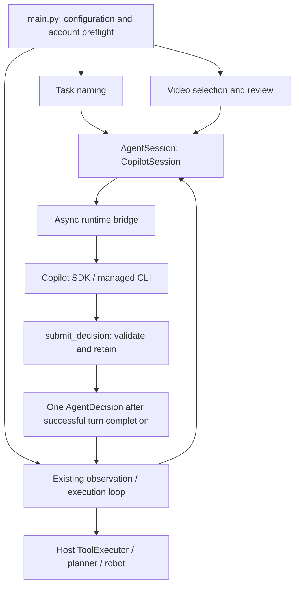
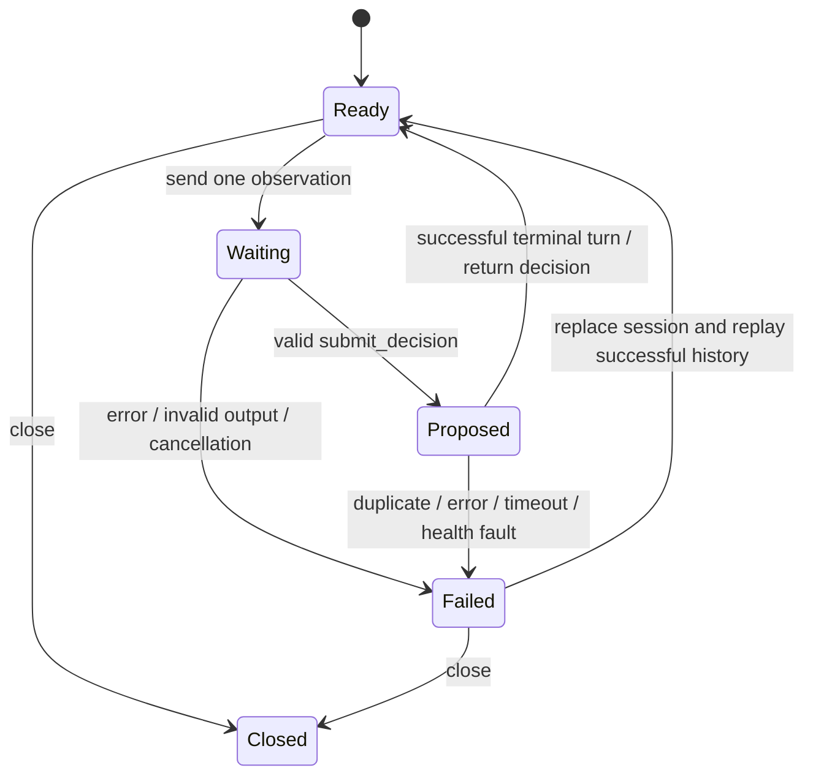

# Design: run GPT-Policy through the employee's Copilot subscription

Status: proposed implementation. Date: 2026-09-20. Repository baseline: `4c43e57`.

This document specifies the replacement; code blocks describe future changes and are not an implemented adapter. The deployment is a local machine, signed in as an individual employee with a company-assigned Copilot seat. The [feasibility assessment](copilot-migration-assessment.md) contains the subscription and product research.

## 1. Decision and scope

Add a `copilot` provider using the official Python SDK, initially pinned to `github-copilot-sdk==1.0.14` and its compatible managed CLI runtime. Selecting `--agent copilot` must route **control decisions, automatic task naming, demonstration-frame selection, and demonstration review** through Copilot. A failure must never silently start Codex or switch to separately billed API credentials.

Use one terminal custom tool, `submit_decision`, to collect a structured proposal. Its handler validates and stores the proposal; the existing host executes any robot action after `decide()` returns. This is the selected implementation, rather than an implicit fallback to extracting JSON from assistant prose. Plain-JSON prompting can be evaluated separately if the terminal-tool compatibility spike fails.

Keep the existing synchronous `AgentSession` contract and robot controller. Keep Codex available as an explicitly selected rollback provider. Change the deployment profile's default to Copilot only after acceptance tests and account validation pass. Existing Claude/Kimi auxiliary routing remains compatible during this change.

The selected SDK release has terminal custom tools and image attachments. Its high-level session wrapper does not have the experimental `response_schema` API shown on the development branch. The adapter must use the pinned release's API. [Release](https://github.com/github/copilot-sdk/releases/tag/v1.0.14), [tool implementation](https://github.com/github/copilot-sdk/blob/v1.0.14/python/copilot/tools.py), [released session implementation](https://github.com/github/copilot-sdk/blob/v1.0.14/python/copilot/session.py).

## 2. Existing execution boundary

Current source responsibilities:

| Source | Current behavior |
| --- | --- |
| `src/gpt_policy/harness/contract.py` | Defines `start(context)`, `decide(turn)`, and `close()`. |
| `src/gpt_policy/harness/models.py` | Defines `AgentContext`, `AgentTurn`, and `AgentDecision`. |
| `src/gpt_policy/harness/codex.py` | Sends the catalog as instructions and requests a JSON decision using Codex `outputSchema`. |
| `src/gpt_policy/runtime/runner.py` | Captures fresh observations, waits for one decision, checks health, records it, and calls the host executor. |
| `src/gpt_policy/harness/validation.py` | Validates the decision envelope and the selected function's arguments, including finite-number checks. |
| `src/gpt_policy/main.py` | Selects providers, but separately hardcodes Codex for naming and video preparation. |

The model-facing robot catalog is descriptive data today, not a collection of native callbacks. Preserve that property. Copilot receives exactly one executable SDK tool: a proposal collector with no reference to a robot, planner, camera, or `ToolExecutor`.



Required invariants:

1. At most one accepted proposal per observation; no model callback executes motion.
2. An accepted proposal is released only after successful turn completion and a final host health check. A timeout, session error, duplicate proposal, or cancellation invalidates it.
3. SDK events from an earlier request cannot satisfy a later request. Aborted or failed native sessions are replaced before reuse.
4. Retry inference only. Preserve the runner's existing fresh-observation retry behavior and never replay a physical command.
5. An inference failure dispatches no decision to `ToolExecutor`. Existing host shutdown/homing behavior remains in force; this is not a promise that cleanup cannot move the robot.

## 3. File map

All paths are relative to the repository root. “New” files are planned, not present yet.

| File | Work |
| --- | --- |
| `pyproject.toml` | Add the pinned `copilot` optional extra with a Python 3.11 marker. Preserve Python 3.10 support for existing providers. |
| `configs/agents/copilot.json` — new | Explicit entitled model, effort, timeout, and live-image window; no credentials or BYOK fields. |
| `src/gpt_policy/harness/config.py` | Register `copilot`; implement a separate parsing branch; allow its image window; require its model and finite timeout. |
| `src/gpt_policy/harness/factory.py` | Lazy-load Copilot; do not require a global `copilot` executable for the managed-runtime path. |
| `src/gpt_policy/harness/models.py` | Add read-only preflight/model-capability values, separate from user configuration and `AgentSession`. |
| `src/gpt_policy/harness/providers/copilot/__init__.py` — new | Export `CopilotSession` without starting processes. |
| `src/gpt_policy/harness/providers/copilot/session.py` — new | Synchronous `AgentSession`, lifecycle, per-call accounting, history rotation, decision completion rules. |
| `src/gpt_policy/harness/providers/copilot/runtime.py` — new | Own the asyncio thread, SDK client, native session, callback/event translation, bounded abort and shutdown. |
| `src/gpt_policy/harness/providers/copilot/decision.py` — new | Proposal gate and terminal-tool declaration; use existing `parse_decision`. |
| `src/gpt_policy/harness/providers/copilot/codec.py` — new | Ordered text/image encoding, attachment labels, and model-limit validation. |
| `src/gpt_policy/harness/providers/copilot/history.py` — new | Bounded live-image replay policy; preserve textual history and static demonstrations. |
| `src/gpt_policy/harness/providers/copilot/preflight.py` — new | Dependency/runtime checks, authenticated identity, model capabilities, and quota metadata. |
| `src/gpt_policy/harness/errors.py` | Add a distinct authentication/policy error if needed; reuse timeout, protocol, overload, and usage-limit errors. |
| `src/gpt_policy/harness/prompts.py` | Add the Copilot display name and separate proposal transport instructions from task semantics. |
| `src/gpt_policy/harness/task_name.py` | Provider-aware default model/effort; retain factory-based execution and strict naming validation. |
| `src/gpt_policy/harness/video_selector.py` | Implement `AgentVideoSelector` on `AgentSession`; preserve frame selection and review validation. |
| `src/gpt_policy/harness/usage.py` | Explicit Copilot normalization and subscription billing metadata; never apply public API dollar rates to it. |
| `src/gpt_policy/runtime/console.py` | Display Copilot token/credit information or “unavailable”; do not show unknown billing as zero. |
| `src/gpt_policy/main.py` | Copilot run directory, auxiliary routing, preflight ordering, and new `--check-agent` option. |
| `src/gpt_policy/preflight.py` | Keep existing `--check` offline; expose selected-provider configuration details. |
| `scripts/smoke_copilot.py` — new | Explicit model-using smoke test with generated image and non-motion proposal schema. |
| `tests/test_config.py`; new tests listed below | Cover configuration, provider lifecycle, images, routing, cache separation, accounting, and fake execution. |
| `README.md` | Installation/login, model discovery, checks, smoke test, and profile switch instructions. |

Reuse the existing manifest, frame extraction, video-cache engine, planning, and recording components. Keep the Codex implementation unchanged initially: implement its history semantics for Copilot with behavioral tests rather than combining both providers in the first patch.

## 4. Configuration and user flow

Proposed packaging addition:

```toml
[project.optional-dependencies]
copilot = ["github-copilot-sdk==1.0.14; python_version >= '3.11'"]
```

This is an addition to the existing extras table. On Python 3.10, selecting Copilot must raise an actionable preflight error even though the environment marker prevents SDK installation. The released SDK requires Python 3.11 or later. [Python runtime requirements](https://github.com/github/copilot-sdk/blob/v1.0.14/python/README.md#prerequisites)

Proposed `configs/agents/copilot.json` template:

```json
{
  "model": "REPLACE_WITH_ENTITLED_GPT_MODEL_ID",
  "effort": "medium",
  "timeout_s": 180,
  "live_image_window": 8
}
```

The placeholder must be replaced before inference; preflight rejects it. Omitted `task_name_model` means the same model for Copilot. An explicitly configured naming model must also be available under the signed-in account. Validate supported effort values rather than silently substituting them. The optional extra uses the SDK-managed runtime; the Copilot branch rejects `executable`, `base_url`, `settings_file`, and credential fields in v1.

Keep the dataclass's existing positional fields stable. Its legacy `executable` field can remain for other providers; Copilot must not use it. Register the new provider as follows:

```python
# Additions to existing registries, not complete module replacements.
AGENT_NAMES = ("codex", "claude", "kimi", "copilot")
_PROVIDER_TYPES["copilot"] = "copilot"
_PROVIDERS["copilot"] = (
    ".providers.copilot.session", "CopilotSession"
)
```

Proposed operator sequence after implementation:

```bash
# In a Python 3.11+ virtual environment:
python -m pip install -e '.[copilot,dev]'
python -m copilot download-runtime

# Sign in with the company account through the supported Copilot CLI login flow.
# Discover available models with --check-agent, then fill in copilot.json.
gpt-policy --agent copilot --check-agent
gpt-policy --agent copilot --check
python scripts/smoke_copilot.py --agent-config configs/agents/copilot.json
```

`--check-agent` is a **new** option: allow model discovery before replacing the placeholder, report it as unconfigured, and exit nonzero until the selected models pass validation. It opens a runtime and makes authentication/model/quota metadata requests, but sends no inference prompt and opens no hardware. `--check` retains its existing configuration-only behavior. The smoke script intentionally uses subscription allowance. Normal robot commands are run only after deployment validation.

Dispatch `--check-agent` immediately after loading the selected agent configuration, before `runtime_config()` or `resolve_run_input()`, and return afterward. It requires neither a task instruction nor calibrated robot settings. Make it mutually exclusive with `--check`. Normal execution moves Copilot's online preflight before **both** the `--prepare-only` branch and automatic naming, and before camera/robot construction. Offline checks and help must work without the optional SDK installed.

Preflight returns an invocation-scoped `AgentAccessReport`: authenticated identity, versions, optional quota, and model capabilities keyed by model ID (vision support, image counts/bytes, context limit, and supported reasoning settings). Unknown fields remain unknown; metadata calls alone cannot prove that an inference will be admitted. Pass this report through a bound factory, rather than storing credentials or transient metadata in `AgentConfig`:

```python
# Proposed application interfaces; report values contain no credentials.
report = preflight_agent(agent_settings, online=True)
run_agent_factory = make_agent_factory(report)

# This callable retains create_agent's existing positional arguments and passes
# the relevant capability snapshot only to CopilotSession's optional keyword.
agent = run_agent_factory(agent_settings, run_input.model)
```

`make_agent_factory(report)` is added to `harness/factory.py`. Add an optional `agent_factory=create_agent` argument to the naming helpers and pass the bound factory through their retries. Video selection already receives the proposed factory injection, plus the effective image limit for its selected model. The codec and session receive the same capability snapshot. If a different model is configured for naming, preflight includes it too. This keeps metadata queries out of the control loop and avoids cross-thread access to a global cache. Missing required image-limit metadata is an explicit compatibility-spike issue; do not substitute Codex's limits.

## 5. Authentication and runtime initialization

Use the regular CLI-compatible SDK mode for stored employee login. Do not select `mode="empty"` with fresh storage: in the pinned client that disables keychain access and changes the runtime home. Reusing a CLI login must be verified using the same credential home, including an intentional `COPILOT_HOME`. [Pinned authentication/runtime construction](https://github.com/github/copilot-sdk/blob/v1.0.14/python/copilot/client.py)

The application does not pass a GitHub token or a model-provider configuration. Construct a child environment from the existing environment, then remove only authentication/routing overrides that would defeat the chosen stored-login mode: `COPILOT_GITHUB_TOKEN`, `GH_TOKEN`, `GITHUB_TOKEN`, `GITHUB_COPILOT_API_TOKEN`, `COPILOT_API_URL`, and inherited `COPILOT_SDK_AUTH_TOKEN`. Clear inherited `COPILOT_DISABLE_KEYTAR` for this mode. Preserve the parent's environment unchanged, including PATH, credential-home, keychain, and corporate proxy settings. Never log token values. Verify/report the authenticated identity rather than assuming the current `gh` identity is the intended employee. [Authentication precedence](https://docs.github.com/en/copilot/how-tos/copilot-sdk/auth/authenticate)

If stored login cannot be resolved, return an authentication error before hardware starts; do not silently use a different token or BYOK route. The compatibility spike must verify login reuse with the SDK-managed runtime on the target workstation.

Native sessions allow only `custom:submit_decision`. Disable file hooks, configuration discovery, skills, on-demand instructions, host Git operations, scheduling, and automatic infinite-session compaction through the pinned session configuration. Keep permission requests denied and unexpected user-input requests fatal. Use a private temporary working directory while preserving credential storage. An empty `mcp_servers` mapping or plugin list must not be assumed to disable discovered configuration; verify effective runtime behavior. Tool allowlisting is not an OS sandbox and does not by itself disable hooks.

Record SDK/runtime versions, selected model, effective restrictions, and session identifiers in the run metadata. No default tools should appear in the acceptance probe. Company model policy remains authoritative; a policy denial is a preflight failure.

Pinned SDK wiring sketch for `runtime.py`. `accept_proposal` is our helper: it checks active request/session identity and deadline, calls the gate below, and invalidates/schedules abort on rejection. It selects the current request rather than closing over the first request of a persistent session.

```python
from copilot import CopilotClient, RuntimeConnection
from copilot.rpc import PermissionDecisionReject
from copilot.tools import Tool, ToolResult
from gpt_policy.harness.errors import AgentProtocolError


def make_submission_tool(context, accept_proposal):
    def submit(invocation):
        try:
            accept_proposal(
                invocation.session_id,
                invocation.tool_call_id,
                invocation.arguments,
            )
        except AgentProtocolError as exc:
            return ToolResult(result_type="failure", text_result_for_llm=str(exc))
        return ToolResult(
            result_type="success",
            text_result_for_llm="Proposal recorded; host execution has not occurred.",
        )

    return Tool(
        name="submit_decision",
        description="Submit one validated decision for later host execution.",
        parameters=context.output_schema,
        handler=submit,
        is_terminal=True,
        defer="never",
        skip_permission=True,  # Only this collector has no execution side effects.
    )


def deny_permission(request, invocation):
    return PermissionDecisionReject(feedback="Host operations are unavailable.")


async def open_native_session(child_env, model, effort, context, accept_proposal,
                              policy_prompt):
    client = CopilotClient(
        connection=RuntimeConnection.for_stdio(),
        mode="copilot-cli",
        use_logged_in_user=True,
        env=child_env,
    )
    try:
        await client.start()
        native = await client.create_session(
            model=model,
            reasoning_effort=effort,
            tools=[make_submission_tool(context, accept_proposal)],
            available_tools=["custom:submit_decision"],
            on_permission_request=deny_permission,
            system_message={"mode": "replace", "content": policy_prompt},
            tool_search={"enabled": False},
            enable_config_discovery=False,
            enable_file_hooks=False,
            enable_on_demand_instruction_discovery=False,
            enable_skills=False,
            included_builtin_skills=[],
            skip_custom_instructions=True,
            enable_host_git_operations=False,
            enable_session_store=False,
            memory={"enabled": False},
            skip_embedding_retrieval=True,
            manage_schedule_enabled=False,
            coauthor_enabled=False,
            infinite_sessions={"enabled": False},
        )
        return client, native
    except BaseException:
        # Production helper bounds stop, uses force_stop if needed, and preserves
        # the original exception. See the lifecycle requirements in section 7.
        await client.stop()
        raise
```

The runtime owner adds the private working directory, event subscriptions, and unexpected-input rejection. The helper illustrates SDK calls, not complete resource management. `skip_permission` applies only to the side-effect-free collector; all actual host operations remain denied. Replacing the system message supplies the robot policy explicitly; it does not establish an OS sandbox. For each turn, compute `remaining_s = request.deadline - time.monotonic()`, fail immediately if nonpositive, and call `native.send_and_wait(prompt, attachments=attachments, timeout=remaining_s)`. Its default is 60 seconds, which would conflict with a configured 180-second deadline. Ignore the optional assistant-message result and require the gate and turn to succeed. An SDK timeout also requires explicit abort and invalidation. Cleanup uses `native.abort()`, `native.disconnect()`, `client.stop()`, and bounded `client.force_stop()` when necessary. [Pinned client API](https://github.com/github/copilot-sdk/blob/v1.0.14/python/copilot/client.py), [session completion and cancellation](https://github.com/github/copilot-sdk/blob/v1.0.14/python/copilot/session.py).

## 6. One decision per observation

The proposal tool's JSON parameters are exactly `AgentContext.output_schema`. The catalog in `context.tools` is used by `parse_decision` to validate the selected operation. This checks both the envelope and the operation-specific schema; the broad envelope alone is insufficient.

The following is application-owned code illustrating `decision.py`. It is independent of SDK callback/result types; `runtime.py` adapts those types to this gate.

```python
from copy import deepcopy
from dataclasses import dataclass
from threading import Lock

from gpt_policy.harness.errors import AgentProtocolError
from gpt_policy.harness.validation import parse_decision


@dataclass
class ProposalGate:
    context: object

    def __post_init__(self):
        self._lock = Lock()
        self._proposal = None
        self._fault = None
        self._closed = False

    def submit(self, arguments):
        with self._lock:
            if self._closed:
                raise AgentProtocolError("Proposal arrived after cancellation")
            if self._proposal is not None or self._fault is not None:
                self._fault = AgentProtocolError("More than one proposal attempt")
                raise self._fault
            try:
                self._proposal = parse_decision(deepcopy(arguments), self.context)
            except AgentProtocolError as exc:
                self._fault = exc
                raise

    def invalidate(self):
        with self._lock:
            self._closed = True
            self._proposal = None

    def finish(self):
        # Called only after successful terminal completion, never on callback alone.
        with self._lock:
            self._closed = True
            if self._fault is not None:
                raise self._fault
            if self._proposal is None:
                raise AgentProtocolError("Turn ended without a decision")
            return self._proposal
```

The SDK tool is declared with `name="submit_decision"`, `parameters=context.output_schema`, and `is_terminal=True`. A successful handler returns an acknowledgement such as “Proposal recorded; host execution has not occurred.” It must not claim that the action succeeded. SDK terminal success ends the agent turn; tool failure alone can let the agent continue, so a gate fault also schedules an explicit abort and marks the request permanently invalid. [Terminal tool behavior](https://github.com/github/copilot-sdk/blob/v1.0.14/python/copilot/tools.py#L73)

Prompt adaptation must remove or replace the existing transport instruction “return only JSON,” including naming/video prompts. Task semantics, frame-selection rules, and robot constraints remain. The Copilot-specific instruction is: select exactly one decision and submit it through `submit_decision`; the host will report execution feedback in the next observation. Assistant text is diagnostic only and is never parsed as an additional command.

Per-request lifecycle:



Enforce one in-flight `decide()` per adapter. Give each request a monotonically increasing generation number, fresh gate, and fresh mailbox. Translate send acknowledgement, usage, error, and completion events on the runtime thread. Correlate events using native session and request/message/turn identifiers, or a per-send boundary verified against the pinned runtime. Never label an arbitrary incoming event with the currently active generation: that would relabel late output as fresh. If correlation cannot be established, retire the native session instead of reusing it. A proposal is returned only when the pinned runtime's terminal completion signal has been observed; verify the exact event sequence in the smoke test instead of assuming `send_and_wait()` returns assistant text after a terminal tool.

## 7. Async SDK behind the synchronous contract

`CopilotSession` owns an `AsyncRuntime` with one background event loop for its lifetime. The runtime owns all SDK objects. The host thread remains responsible for health polling and usage-ledger writes.

Application-level sketch for `session.py` (helper methods are proposed application code):

```python
import queue
import time

from gpt_policy.harness.errors import AgentTimeoutError
from gpt_policy.harness.usage import model_call
from gpt_policy.harness.waiting import receive_event


def wait_for_decision(runtime, request, model):
    # Set by decide() before encoding, refresh, and SDK submission begin.
    deadline = request.deadline
    with model_call("copilot", model) as call:
        try:
            while True:
                event = receive_event(request.mailbox, deadline=deadline)
                if event.generation != request.generation:
                    continue
                if event.kind == "request_started":
                    call["request_started"] = True
                elif event.kind == "usage":
                    request.usage.add(event.payload)
                elif event.kind == "failed":
                    raise event.error
                elif event.kind == "completed":
                    # Completion has already checked gate + native turn status.
                    if time.monotonic() >= deadline:
                        raise AgentTimeoutError("Copilot decision arrived too late")
                    return event.decision
        except queue.Empty as exc:
            runtime.cancel(request)  # Invalidate first; then abort with a deadline.
            raise AgentTimeoutError("Copilot decision timed out") from exc
        except BaseException:
            runtime.cancel(request)
            raise
        finally:
            # Snapshot includes received usage and drained cancellation telemetry.
            call.update(request.accounting_snapshot())
```

`request.accounting_snapshot()` must retain evidence that a send began even if interruption occurred before the host consumed its `request_started` event. It marks incomplete usage explicitly and never includes credentials or raw image data. Record the call in the host thread so `collect_usage()` and `usage_phase()` retain their `ContextVar` context; SDK callbacks never mutate `UsageLedger` directly.

`cancel()` first invalidates the gate, then aborts the native session. Bound abort/cleanup to five seconds as an initial policy. If abort cannot be confirmed, stop the adapter-owned runtime and prohibit further decisions on it. Do not mask the original health/interrupt error with a cleanup exception. Preserve the current second-interrupt behavior during active cancellation/homing; bounded resource finalization retains the host's existing interrupt policy. `close()` is idempotent and handles partially initialized client/session/thread state.

Use the same interruptible mailbox pattern for startup and refresh. The existing `receive_event()` polls health approximately every 100 ms while monitoring is active. Avoid a blocking `asyncio.run()` or `Future.result(timeout=180)` in the robot thread. The runner's post-decision health check remains the last gate before execution.

Error mapping is explicit:

| Condition | Host result |
| --- | --- |
| Runtime-reported transient overload/rate limit | `AgentOverloadedError`; the existing runner retries with a fresh observation. |
| Quota/credit exhaustion | `AgentUsageLimitError`; stop control inference. |
| Missing login, forbidden model, policy denial | Authentication/policy error; no provider fallback. |
| Invalid/missing/duplicate proposal or unexpected interaction | `AgentProtocolError`; invalidate the session. |
| Deadline exceeded | `AgentTimeoutError`; abort and discard late output. |
| Unknown transport or runtime failure | Fail closed; do not guess that retry is safe from message substrings. |

Pin mappings to documented/observed structured codes in the compatibility fixture. Do not classify every HTTP 429 as exhausted quota, or every transport disconnect as overload.

## 8. Images and history

Reuse `media.content_blocks()` for image conversion, including configured JPEG quality. The Copilot codec builds a prompt and separate image attachments. Insert a stable numbered reference where each image occurred in the original sequence, and match it to attachment `displayName` and order. Example encoding:

```python
attachment = {
    "type": "blob",
    "data": encoded_image.data,       # Base64 bytes, without a data-URL prefix.
    "mimeType": encoded_image.mime_type,
    "displayName": "image-003-right-wrist-t12.340s",
}
```

Do not flatten multiple camera views into an unlabeled image collection. Record any difference from Codex's interleaved-image/detail semantics as part of the model comparison. Blob attachment support does not prove equal image resolution or reasoning behavior. [Released attachment types](https://github.com/github/copilot-sdk/blob/v1.0.14/python/copilot/session.py#L251)

Validate model image counts, MIME types, per-image size, and context capacity. Video selection currently permits 24 candidates, potentially three camera views each. A model supporting fewer than 72 images needs smaller windows based on actual image counts, with existing index remapping and overlapping boundaries preserved. Include the batching/encoding policy in cache identity. Fail with an actionable size error if one candidate's views or the mandatory first-turn demonstration cannot fit; never silently drop views or truncate a demonstration.

Final review is a single global curation request in v1. If its complete input exceeds the model's image budget, fail before sending and require a shorter or already reviewed demonstration. The existing `video_cache._review()` 48-image calculation bounds the **selected output**, not the input attachments; do not treat it as an input guard. Hierarchical multi-pass review is a separate follow-up design because it changes curation behavior. This makes the initial supported video workload explicit without rewriting the cache engine.

History policy matches current Codex behavior:

- The native session can accumulate up to `live_image_window` live camera groups between refreshes.
- Host history retains all successful decision records and observation/feedback text. Static demonstration content remains available, while only the newest previous live-image group is retained locally.
- Before the next live observation would exceed the window, create a fresh native session. Replay static context, textual records, historical proposals explicitly labeled as historical, and the retained previous image group, then append the current observation.
- Failed/partial requests are excluded. A historical proposal is never described as executed unless subsequent host feedback confirms execution.
- Disable automatic compaction for v1; it is not equivalent to this policy. Text history is still finite only through the decision budget and model context limit. If replay exceeds capacity, stop rather than silently summarize it.

Expose `last_context_refresh` and `last_decision_timing` with provider-neutral session IDs so existing run recording remains useful. Count image groups independently of total attachments. Add boundary tests around the eighth/ninth observation and around overload recovery.

## 9. Remove hidden Codex dependencies

### Auxiliary routing and naming

Use one explicit compatibility policy in `main.py`, evaluated only when naming or video preparation is needed:

```python
def auxiliary_agent_config(selected, settings, config_path):
    if selected.type in {"codex", "copilot"}:
        return selected
    if selected.type == "claude_code":
        # Preserve existing Claude/Kimi behavior during the Copilot migration.
        directory = Path(settings.get("agent_config_dir", config_path.parent))
        return named_agent_config("codex", directory)
    raise ValueError(f"Unsupported auxiliary provider: {selected.type}")


def naming_model(config):
    if config.task_name_model:
        return config.task_name_model
    if config.type == "copilot":
        return config.model  # Required by configuration validation.
    return DEFAULT_TASK_NAME_MODEL
```

Apply the same helper to display text and the actual naming call. Do not force the current Codex-specific default model or `low` effort onto Copilot; an omitted naming effort inherits the selected provider's effort. A configured naming-model fallback may remain within the same provider, but account-wide quota exhaustion must stop rather than cycle through models.

An explicit Copilot model takes precedence over `manifest.model` through existing `resolve_run_input()` behavior. Test old saved tasks and matched task requests containing Codex model IDs: the effective Copilot model must remain the configured one.

### Provider-neutral video selector

Reuse `AgentSession`; a second generic structured-output client is unnecessary. `AgentVideoSelector` builds a real `AgentContext` for the existing `select_video_frames` decision, allowing both Copilot's gate and the current host validator to work:

```python
def select_once(config, request, content, instructions, schema, agent_factory):
    parameters = schema["properties"]["arguments"]
    context = AgentContext(
        instructions=instructions,
        tools=[{"type": "function", "function": {
            "name": "select_video_frames",
            "description": "Select and annotate supplied demonstration frames.",
            "parameters": parameters,
        }}],
        output_schema=schema,
    )
    agent = agent_factory(config, config.model)
    try:
        agent.start(context)
        decision = agent.decide(AgentTurn(request, content=content))
        return parse_decision({
            "name": decision["name"],
            "arguments": decision["arguments"],
        }, context)
    finally:
        agent.close()
```

Use this helper for both window selection and final review, with the existing prompt and schema for each. Preserve `_validate_selection()`, chronological sorting, view association, window-to-global indices, and mandatory review endpoints. Inject `agent_factory` for tests. Resolve a missing Codex model using its legacy default before calling the helper; Copilot has no implicit model default.

Continue satisfying `CacheableFrameSelector` in `input/video_cache.py`. Bump the selector algorithm identity and include provider, effective model, effort, prompt/schema hashes, image encoding/batching policy, and adapter version. Review identity must also reflect provider and review policy. Old cache entries remain on disk but must not be returned as Copilot results.

## 10. Usage and reproducibility

Keep one host ledger record per requested decision, including failed requests that reached the runtime. A native turn can contain more than one model call; aggregate its usage events without counting cumulative snapshots again. Store request/session/generation IDs, phase, timing, model, SDK/runtime version, raw sanitized usage, and completeness.

Add an explicit `provider == "copilot"` branch in `normalize_usage()`. Preserve unknown counters as `None`; verify whether cached tokens are subsets before deriving totals. Event fields named `cost` must not be treated as USD or AI credits without their documented unit.

Change `UsageLedger.record()` so Copilot bypasses `estimate_cost()`:

```python
if call["provider"] == "copilot":
    call.update(
        estimated_cost_usd=None,
        pricing=None,
        cost_unavailable_reason="copilot_subscription_billing",
    )
else:
    call.update(estimate_cost(call["model"], call["usage"]))
```

Add separate subscription fields for provider-reported AI credits and quota snapshots, with their units and source. Session-wide accumulated metrics must be sampled as deltas if used per decision, or stored once at session close; do not add the same totals to every turn. Account quota deltas may include other applications and are not exact run costs. Experimental metrics are optional telemetry, not a prerequisite for returning a validated decision. Update summary metadata and console rendering so public API price assumptions are not applied to Copilot. [SDK usage signals](https://docs.github.com/en/copilot/how-tos/copilot-sdk/features/usage-and-billing)

## 11. Implementation sequence and tests

| Step | Deliverable and completion criterion |
| --- | --- |
| 1. Compatibility spike | On the intended account, prove stored-login reuse, selected GPT vision, terminal tool event sequence, effective restrictions, and explicit abort with the pinned versions. Start with a synthetic image and non-motion schema, then validate the actual control/naming/video schemas using synthetic observations and no executor. |
| 2. Adapter and configuration | Implement Copilot package, config/factory, lifecycle, codec, and offline fake-runtime tests. Imports and `--check` start no SDK process. |
| 3. Context and accounting | Add deterministic refresh, size checks, error mapping, usage normalization, and interruption tests. |
| 4. Complete routing | Replace naming/video Codex calls for Copilot; verify `--prepare-only`, saved task selection, and cache identity. |
| 5. Deployment trial | Run fake-executor integration, then compare recorded observations and measured latency/usage. Select Copilot in the machine profile after acceptance. |

Planned test files and behavioral assertions:

| Test file | Assertions |
| --- | --- |
| `tests/test_config.py` | Copilot is selectable; model/timeout required; no Claude credential read; managed runtime accepted without global CLI; Python compatibility and rejected fields. |
| `tests/test_copilot_decision.py` | Valid proposal; unknown operation; wrong function arguments; NaN; duplicate/late/missing proposals; no text fallback; invalid attempt cannot later become valid. |
| `tests/test_copilot_session.py` | Completion after proposal; error after proposal; timeout/abort; stale events; health fault while waiting; request accounting after interruption; startup failure; idempotent close. |
| `tests/test_copilot_codec.py` | Labels, camera order, timestamps, MIME/base64, JPEG behavior, byte/image limits, and no silent truncation. |
| `tests/test_copilot_history.py` | Window boundary; demonstration retention; old camera removal; successful-history-only replay; context overflow and recovery. |
| `tests/test_auxiliary_routing.py` | Copilot naming and video never load Codex; existing Claude/Kimi route preserved; old saved model names cannot override selected Copilot model. |
| `tests/test_video_selector.py` | Both selection/review use injected factory; semantic validator preserved; multi-view batching and global indices; provider/model changes cause cache misses. |
| `tests/test_copilot_usage.py` | No Anthropic normalization or API-dollar pricing; partial usage; event deduplication; cumulative-metric deltas; correct naming/demo/control phases. |
| `tests/test_copilot_pipeline.py` | Fake camera/robot/executor: valid decisions dispatch once; inference failures dispatch zero decisions; cleanup checked separately; no Codex launch anywhere. |

Default tests use fake SDK/runtime objects and make no model requests. Account smoke tests remain explicit scripts, outside the default test suite. Verify a Copilot run with all attempted Codex imports/launches patched to fail, including naming and video paths. Do not use `configs/examples/simulated.json` as a simulator: it still selects an ARX backend and CAN interface.

## 12. Acceptance and remaining integration gates

The replacement is ready when a selected Copilot profile completes naming, demonstration preparation, and a fake-executor control run with Codex unavailable; each returned decision passes existing validation; cancellation prevents late decisions; and the usage record identifies Copilot subscription accounting correctly. SDK/runtime resources must be released on successful, failed, and interrupted runs.

The compatibility spike must resolve three concrete unknowns before hardware work: the employee's actual entitled GPT model and image limits, the pinned runtime's terminal-tool completion events with this project's schemas, and stored-login reuse alongside the selected configuration restrictions. The design does not claim those account-specific or end-to-end behaviors have already been tested.

The deployment switch is a profile change, not deletion of Codex code. An explicit `--agent codex` remains available for comparison or rollback, and must never occur automatically because Copilot fails.
